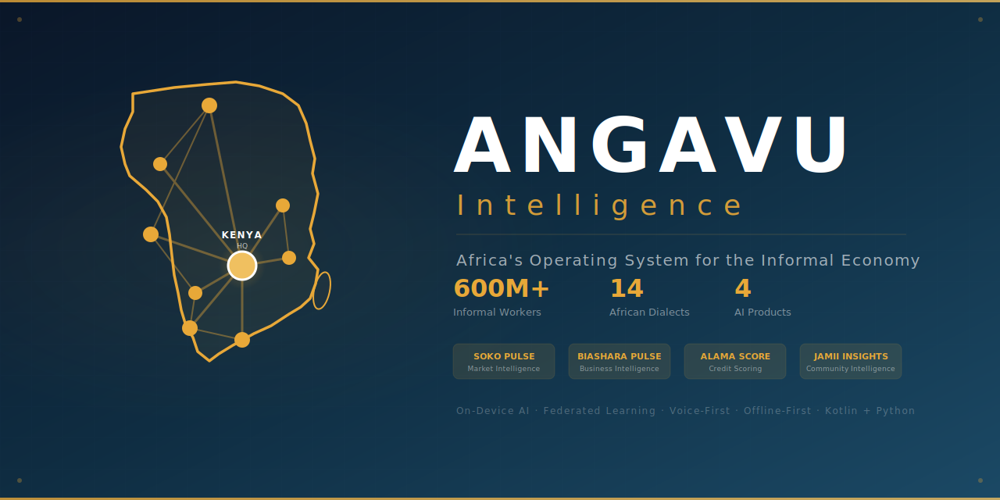

<div align="center">



### Making 200 Million Invisible Workers Visible Through Data

**Angavu Intelligence** is the operating system for Africa's informal economy.
Voice-first. Offline-first. Speaks your language. Runs on $50 phones.

**Not competing. Just operating.**

---

### 📊 The Problem

| Stat | Value |
|------|-------|
| Africa's informal workers | **600M+** |
| Kenya's informal employment | **83%+** |
| Contribution to GDP | **~35%** |
| Data infrastructure | **Zero** |
| AI tools built for them | **Zero** |

### 🎯 Our Products

| Product | What It Does | Users |
|---------|-------------|-------|
| **Soko Pulse** | Real-time market intelligence — prices, demand, trends | Traders, farmers |
| **Biashara Pulse** | AI CFO — cash flow, costs, daily briefings | All informal workers |
| **Alama Score** | Credit scoring without formal records | Borrowers, lenders |
| **Jamii Insights** | Community-level economic intelligence | Counties, NGOs, policy |

### 🏗️ Architecture

```
📱 Msaidizi App (Android)
├── Voice-first (14 African dialects)
├── Offline-first
├── On-Device AI (Qwen 0.5B via llama.cpp NDK)
├── Multi-Agent System (7 agents)
├── Federated Learning
└── 207 Kotlin files

☁️ Angavu Intelligence Backend (Python)
├── 33 AI Agents across 6 swarms
├── Event Bus Architecture
├── Domain-Specific Agents (Agriculture, Retail, Transport...)
├── 15 Intelligence Products
└── 349 Python files
```

### 🔬 Research Compendium (2026)

221-page thesis-grade research document covering:

| # | Swarm | Focus |
|---|-------|-------|
| 1 | 🔬 Voice Models | Speech-to-speech, dialect adaptation, emotion detection |
| 2 | 🧠 Reasoning Models | On-device reasoning, hybrid inference, financial analysis |
| 3 | 🤖 Agentic Systems | MCP/A2A protocols, multi-agent coordination |
| 4 | 🔄 Loops & Orchestration | OODA, ReAct, Reflexion, self-improving systems |
| 5 | ⚛️ Quantum Computing | Post-quantum crypto, optimization, timeline to impact |
| 6 | 🏁 AGI Race | AGI timeline, geopolitical dynamics, Africa positioning |
| 7 | 🌐 Emerging Systems | New architectures, on-device AI, open-source revolution |
| 8 | ✊ Humanity & Ethics | Big Tech exploitation, African language AI training |
| 9 | 📚 Missing Units | Applied stats, CS, math — what's needed beyond the degree |

### 💡 The Thesis

> Information asymmetry (Akerlof, 1970), adverse selection (Stiglitz, 1981), and coordination failures (Diamond-Mortensen-Pissarides, 2010 Nobel) are the core problems of the informal economy. Angavu solves all three through AI-powered economic intelligence.

### 🔧 Tech Stack

**Mobile:** Kotlin • Jetpack Compose • llama.cpp NDK • Room DB • Hilt DI
**Backend:** Python • FastAPI • SQLAlchemy • Multi-Agent Runtime • Event Bus
**AI:** Qwen 0.5B (on-device) • Whisper (ASR) • Piper (TTS) • Federated Learning
**Infra:** GCP Johannesburg • Docker • GitHub Actions CI/CD

### 📈 The Moat

| Barrier | Description |
|---------|-------------|
| **Data Moat** | Every transaction trains the AI. Years of proprietary data. |
| **Trust Moat** | Earned through daily voice interaction in local languages. |
| **Architecture Moat** | On-device LLM + federated learning + multi-agent swarms. |
| **Language Moat** | Real Swahili with regional dialects and cultural idioms. |
| **Cost Moat** | $60-100K/month vs. $10-20M/month for rented APIs at 200M users. |

### 👤 Founder

**Valentine Owuor** — BSc Economics & Statistics, Masinde Muliro University (December 2026)

*"My mum is a micro retail trader. I watched her from class 1 to university. She's the reason this company exists."*

---

**Built for the workers the world forgot.**

[🌐 Website](https://angavuintelligence.com) • [📱 Msaidizi App](https://github.com/ovalentine964/msaidizi-app) • [☁️ Backend](https://github.com/ovalentine964/angavu-intelligence-backend) • [📄 Research Compendium](https://github.com/ovalentine964/angavu-intelligence/tree/main/research)

</div>
