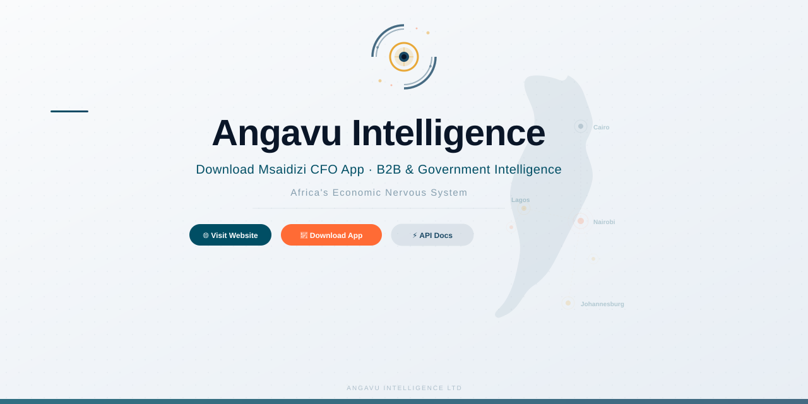

<p align="center">
  
</p>

<p align="center">
  
  
  
  
  
</p>

<p align="center">
  <strong>Angavu Intelligence Ltd.</strong> — Africa's Economic Nervous System<br>
  Data infrastructure for the $1.5 trillion informal economy that employs 85% of Africa's workforce.
</p>

🔗 **[Live Website](https://ovalentine964.github.io/angavu-intelligence/)** · 📱 **[Download Msaidizi CFO](https://ovalentine964.github.io/angavu-intelligence/download.html)**

---

## Products

| Product | Audience | Status | Description |
|---------|----------|--------|-------------|
| **Msaidizi CFO** | Informal workers | ✅ Available — Free | Android app — AI CFO, voice-first in 15+ languages, offline-first |
| **Economic Intelligence** | Enterprises, lenders, government | Contact us | Real-time demand intelligence, credit scoring, economic dashboards |

> **Note:** Soko Pulse, Alama Score, and Angavu Pulse are enterprise modules available through our Economic Intelligence platform. [Contact us](mailto:hello@angavuintelligence.com) for access.

---

## Latest: 18 Research Council Implementations

All 18 research/implementation councils have completed, delivering:

- **Graph Engineering** — Tool dependency graph, knowledge graph, workflow DAG
- **Loop Engineering** — OODA loop, self-correction, circuit breakers, drift detection
- **Council Engineering** — 6 councils (Finance, Inventory, Market, Growth, Agriculture, Extractive), agent spawning, event bus
- **Alama Score Calibration** — 8 worker-type feature extractors with seasonality adjustment
- **Health Metrics** — Occupation-hazard matrices for 10 worker types, insurance eligibility engine
- **Service Price Discovery** — Transport, construction, beauty, repair pricing intelligence
- **Harvest & Produce Tracking** — Farmers, fishermen, miners with yield prediction
- **Job & Customer Marketplace** — Fundis, househelps, entertainers matching
- **Voice-First UI** — 14 Compose screens, always-on voice, Swahili-first
- **Onboarding & Localization** — 240 Swahili prompts, 14 language support
- **Accessibility & Low-Literacy Design** — Icon-first, voice-everywhere, high contrast
- **Design System** — Custom colors, typography, cards, charts, navigation

---

## Tech Stack

- **Frontend:** HTML5, CSS3, Vanilla JavaScript
- **Architecture:** Progressive Web App (PWA) with offline support
- **Design System:** Custom CSS tokens, mobile-first responsive layout
- **Hosting:** GitHub Pages
- **No frameworks, no build step** — fast, accessible, zero dependencies

---

## Repository Structure

```
├── index.html              # Landing page
├── download.html           # APK download + QR code
├── for-workers.html        # Msaidizi CFO showcase
├── msaidizi.html           # Msaidizi product deep-dive
├── about.html              # Company & team
├── technology.html         # Superagent architecture
├── vision.html             # Company story & mission
├── testimonials.html       # User stories
├── api.html                # Developer API docs
├── privacy-policy.html     # Privacy by architecture
├── style.css               # Main stylesheet
├── design-tokens.css       # Design system tokens
├── script.js               # Application logic
├── manifest.json           # PWA manifest
├── sw.js                   # Service worker
├── assets/                 # Logos, icons, images
└── docs/                   # Internal research & architecture docs
```

---

## Mission

We believe every market trader, mama mboga, and boda-boda driver deserves the same financial visibility as a Fortune 500 CFO. Angavu Intelligence is building the nervous system to make that real.

**From Migori, Kenya to every informal market on earth.**

---

## Contact

- 📧 hello@angavuintelligence.com
- 📍 Migori, Kenya

---

© 2026 Angavu Intelligence Ltd. All rights reserved.

---

*Built by 18 research councils. Powered by Africa's informal economy.*
